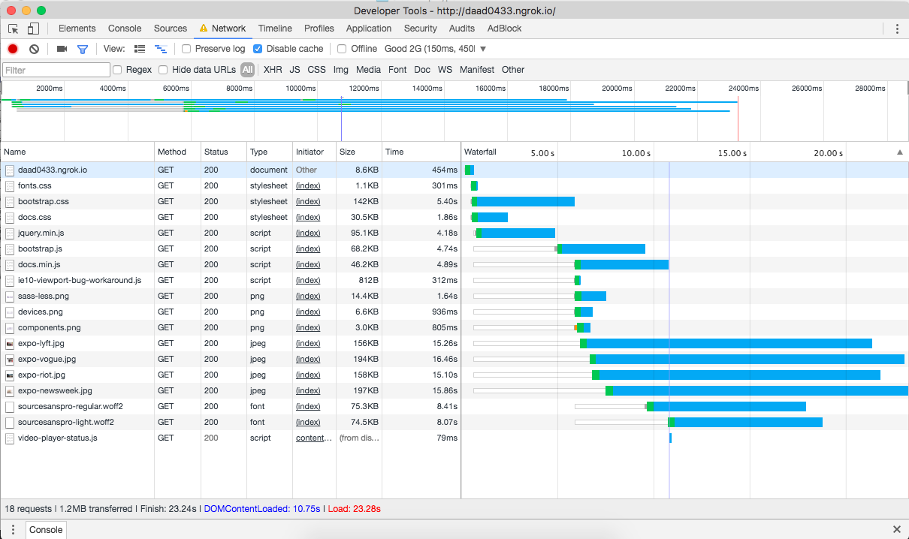
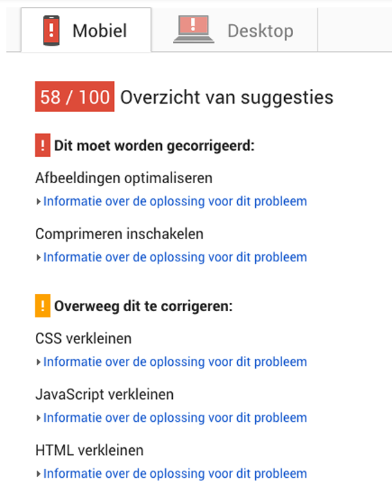
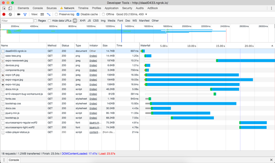
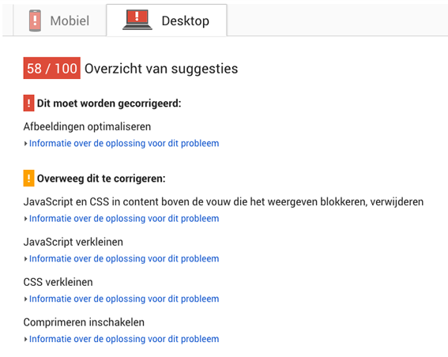
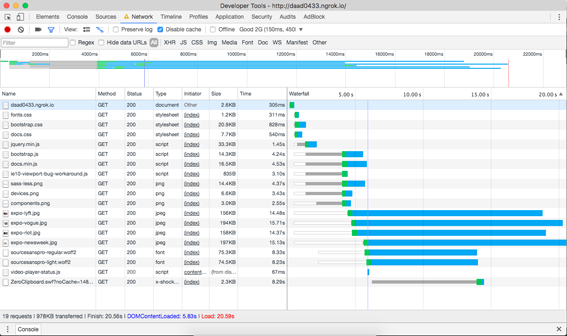
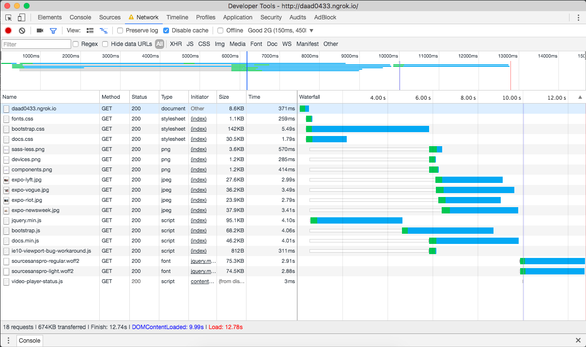

# Performance matters
While testing the performance of the Bootstrap website I learned a lot of new ways to make a website faster.
Here are some things I've learned this week:
* Perceived performance is a big part of the user experience.
* 100ms will feel like an instant reaction, 1000ms will feel like an uninterupted flow.
* There is such a thing as HTTP2 and it's great, but optimizing for HTTP2 will mean **really** hurting the experience of HTTP1 users.
* The biggest part of all requests a page makes are images most of the time.
* Performance is more important than aesthetics.

## Initially
When I started the page took about 23 seconds to load and it got a google pagespeeds rating of only 48.
 

### Adding critical CSS
Adding inline critical css to `<head>` and moving the rest of the css to just before the `</body>` tag. It didn't immediately save a lot of time but it did boost Google Pagespeeds rating up 10 points. It is quite labor-intensive, because it has to be added inline to each HTML document. Also when you change one CSS line it has to be rendered again. 
There are some ways to automate this process but it was to complicated to figure this out by myself in a week.
 

## Compressing JavaScript and CSS to zipfiles
This was completely new to me but it actually saved three seconds of load time and also boosted the Google Pagespeeds rating with ten points. It compresses all JavaScript and CSS files to zipfiles, which significantly saves loadtime.
Figuring out how to actually do this was impossible without the help of Janno, I do hope next week things with Node.js will become a little more clear.
 

* Minimizing CSS documents boosts google pagespeed's rating a lot.

* Compressing files makes the website much faster and is very easy to do via the terminal and editing server.js.
