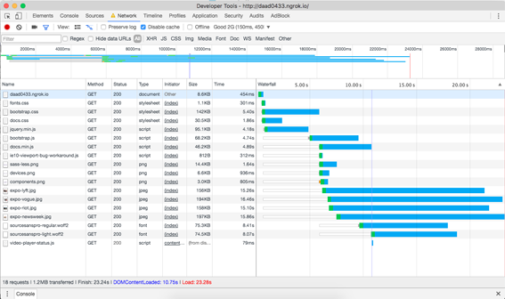
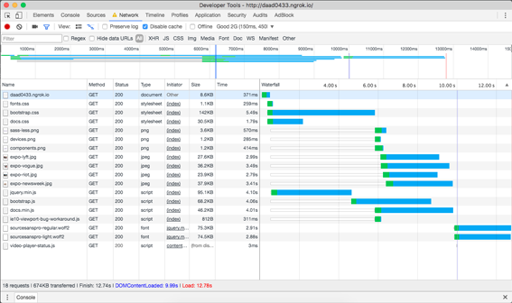
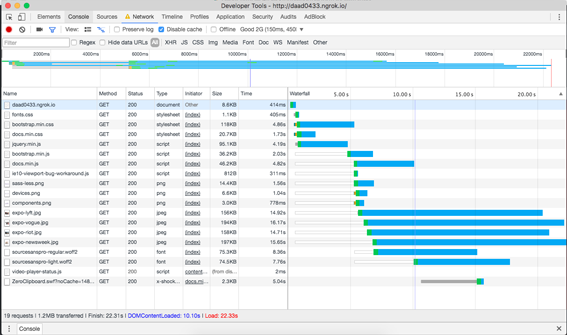
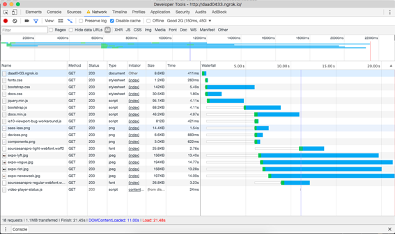

# Performance matters
While testing the performance of the Bootstrap website I learned a lot of new ways to make a website faster.
Here are some things I've learned this week:
* Perceived performance is a big part of the user experience.
* 100ms will feel like an instant reaction, 1000ms will feel like an uninterupted flow.
* There is such a thing as HTTP2 and it's great, but optimizing for HTTP2 will mean **really** hurting the experience of HTTP1 users.
* The biggest part of all requests a page makes are images most of the time.
* Performance is more important than aesthetics.
To test and improve the performance of the Bootstrap website I used the Networks tab (I used 'Good 2G as network speed) of Chrome's Developer Tools and Google Pagespeeds. 

## Initially
When I started the page took about 23 seconds to load and it got a google pagespeeds rating of only 48. I made feature branches for all seperate features to have a more contained test. 
<br>



### [Adding critical CSS](https://github.com/Sidstumple/performance-matters/tree/feature/css)
Adding inline critical css to `<head>` and moving the rest of the css to just before the `</body>` tag. It didn't immediately save a lot of time but it did boost Google Pagespeeds rating up 10 points. It is quite labor-intensive, because it has to be added inline to each HTML document. Also when you change one CSS line it has to be rendered again. 
There are some ways to automate this process but it was to complicated to figure this out by myself in a week.
<br>


### [Compressing JavaScript and CSS to zipfiles](https://github.com/Sidstumple/performance-matters/tree/feature/compress)
This was completely new to me but it actually saved three seconds of load time and also boosted the Google Pagespeeds rating with ten points. It compresses all JavaScript and CSS files to zipfiles, which significantly saves loadtime.
Figuring out how to actually do this was impossible without the help of Janno, I do hope next week things with Node.js will become a little more clear.
<br>
Code for adding compress to `server.js`:
```
const compression = require('compression');
const app = express();
app.use(compression());
```
<br>


### [Resizing images](https://github.com/Sidstumple/performance-matters/tree/feature/images)
Resizing the images had a huge impact on the loading time, not so much on Google Pagespeeds. This didn't come as a big surprise, in the lectures of this course Declan had already mentioned images usually takeup a lot of loading time.
<br>



### [Minimizing JavaScript & CSS files](https://github.com/Sidstumple/performance-matters/tree/feature/minimize)

Minimizing CSS and JavaScript documents saved a lot of load time (about 10 seconds). The pagespeed was only 10 points up again. 
This was pretty easy to do by hand and it will only be faster when I can use tools to minify everything at once.
<br>



### [Font optimization](https://github.com/Sidstumple/performance-matters/tree/feature/fonts)
I uploaded the used fonts to the [webfont generator of Font Squirrel](https://www.fontsquirrel.com/tools/webfont-generator). This didn't do too much for the performance of the website in either Google Pagespeeds' rating nor the network tab of the developer tools. Overall it probably did help a bit but I would say this is only necessary when using a lot of custom fonts.
<br>



### In conclusion...
When I merged al seperate feature branches to my develop branch the result was immediately noticable:
<br>


<br>
The load time was now only 6 seconds, a change of about 16 seconds with the initial Bootstrap website.
The Google Pagespeeds rating was almost perfect, 98 points. Seperately these optimizations do little, but together they make a huge change.

